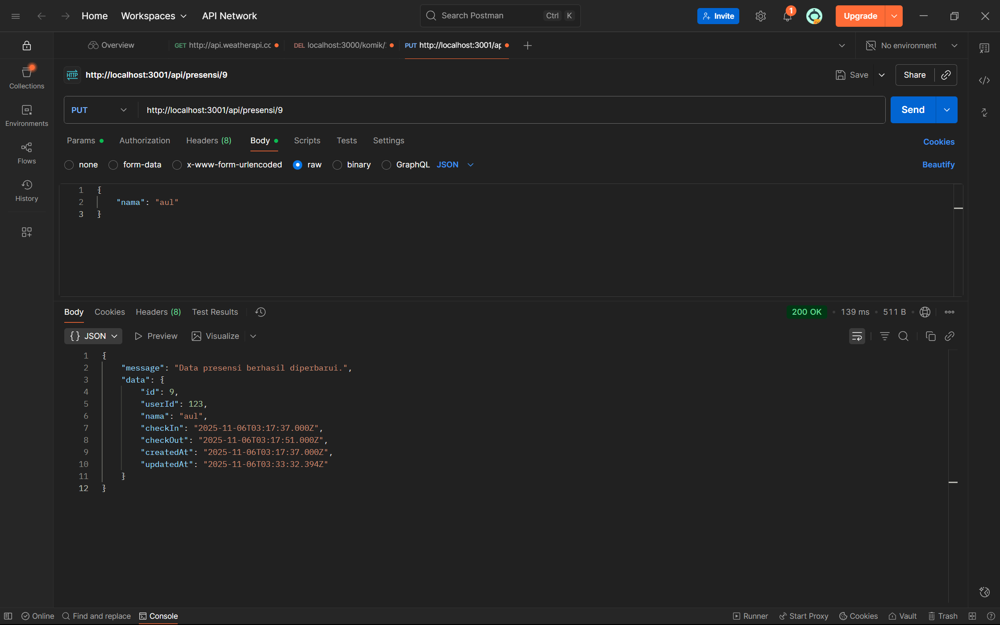
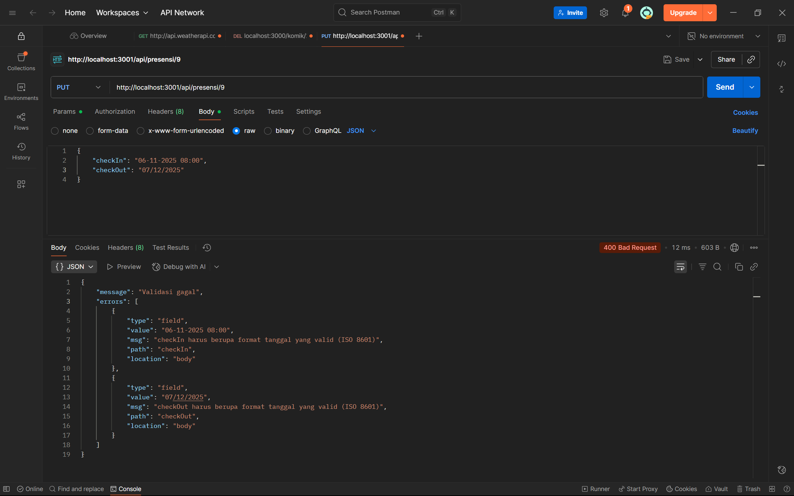
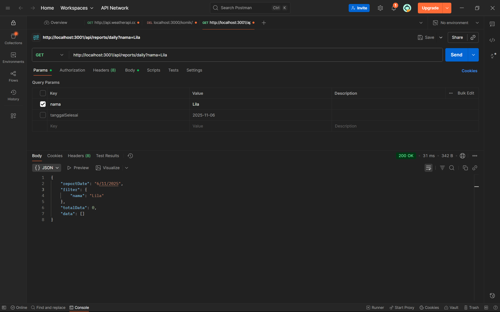
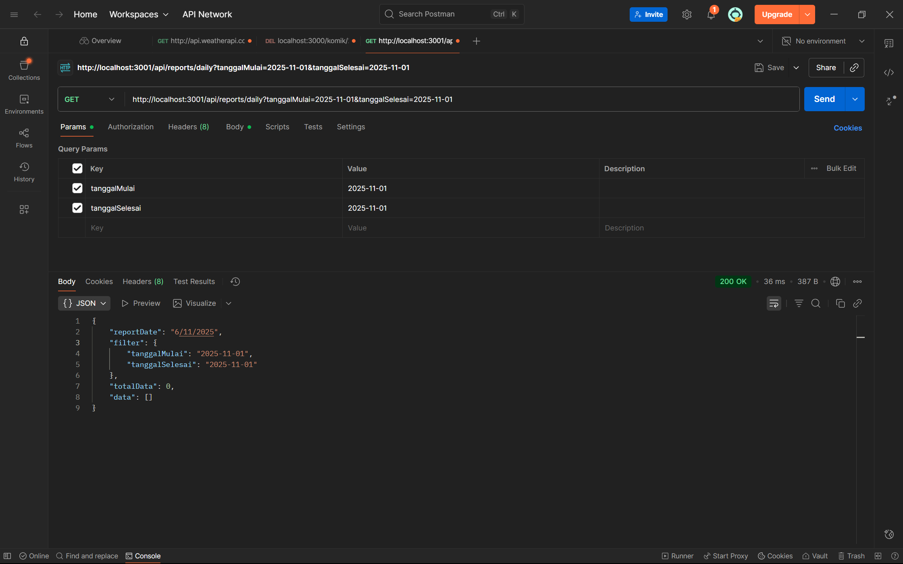

# Tugas 5

1. Tampilan Endpoint Create Book (UPDATE DATA PRESENSI)

2. Tampilan Endpoint Create Book (UPDATE format tanggal yang diisi tidak valid)

3. Tampilan Endpoint Create Book (DELETE)

4. Tampilan Endpoint Create Book (GET BERDASARKAN NAMA)

5. Tampilan Endpoint Create Book (GET BERDASARKAN TANGGAL)
